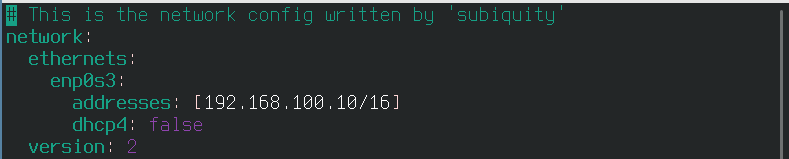
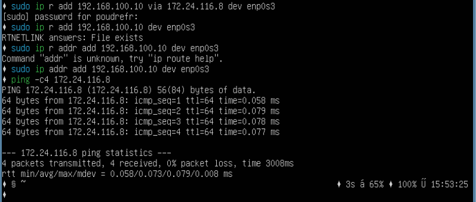
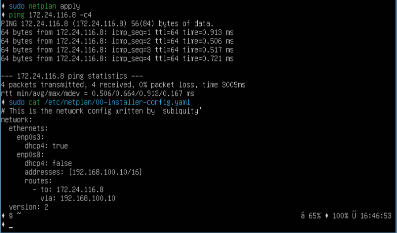

# Linux Network

Настройка сетей в Linux на виртуальных машинах.


## Part 1. ipcalc tool

##### Запущена виртуальная машинa (далее --ws1)
- Результат запуска userver00:
  

#### 1.1. Networks and Masks
##### Определи и запиши в отчёт:
1) Адрес сети *192.167.38.54/13*

2) Перевод маски *255.255.255.0* в префиксную и двоичную запись, */15* в обычную и двоичную, *11111111.11111111.11111111.11110000* в обычную и префиксную


3) Минимальный и максимальный хост в сети *12.167.38.4* при масках: */8*, *255.255.254.0* и */4*

4) Минимальный и максимальный хост в сети *12.167.38.4* при масках: *11111111.11111111.00000000.00000000*


#### 1.2. localhost
##### Определи и запиши в отчёт, можно ли обратиться к приложению, работающему на localhost, со следующими IP: *194.34.23.100*, *127.0.0.2*, *127.1.0.1*, *128.0.0.1*

- 194.34.23.100 (нельзя)

- 127.0.0.2 (можно)

- 127.1.0.1 (можно)

- 128.0.0.1 (нельзя)

#### 1.3. Network ranges and segments
##### Определи и запиши в отчёт:
##### 1) Какие из перечисленных IP можно использовать в качестве публичного, а какие только в качестве частных: *10.0.0.45*, *134.43.0.2*, *192.168.4.2*, *172.20.250.4*, *172.0.2.1*, *192.172.0.1*, *172.68.0.2*, *172.16.255.255*, *10.10.10.10*, *192.169.168.1*

- *10.0.0.45* частный
- *134.43.0.2* публичный
- *192.168.4.2* частный


- *172.20.250.4* частный
- *172.0.2.1* публичный
- *192.172.0.1* публичный


- *172.68.0.2* публичный
- *172.16.255.255* частный
- *10.10.10.10* частный


- *192.169.168.1* публичный

##### 2) Какие из перечисленных IP адресов шлюза возможны у сети *10.10.0.0/18*: *10.0.0.1*, *10.10.0.2*, *10.10.10.10*, *10.10.100.1*, *10.10.1.255*


- 10.0.0.1 (нет)

- 10.10.0.2 (возможен)

- 10.10.10.10 (возможен)

- 10.10.100.1 (нет)

- 10.10.1.255 (возможен)

## Part 2. Static routing between two machines

##### Подними две виртуальные машины (далее -- ws1 и ws2).

- две виртуальные машины

##### С помощью команды `ip a` посмотри существующие сетевые интерфейсы.

- результат `ip a` на ws1.

- результат `ip a` на ws2.


##### Опиши сетевой интерфейс, соответствующий внутренней сети, на обеих машинах и задать следующие адреса и маски: ws1 - *192.168.100.10*, маска */16*, ws2 - *172.24.116.8*, маска */12*.

- ws1 - *192.168.100.10/16*
- открыл через vim с помощью `sudo vim /etc/netplan/00-installer-config.yaml` прописываем адрес


- ws2 - *172.24.116.8/12*
- открыл через vim с помощью `sudo vim /etc/netplan/00-installer-config.yaml` прописываем адрес

##### Выполни команду `netplan apply` для перезапуска сервиса сети.

- netplan apply на ws1, изменился IP


- netplan apply на ws2, изменился IP

#### 2.1. Adding a static route manually
##### Добавь статический маршрут от одной машины до другой и обратно при помощи команды вида `ip r add`.
##### Пропингуй соединение между машинами.

- `ip r add` на ws1

 
- `ip r add` на ws2

#### 2.2. Добавление статического маршрута с сохранением
##### Перезапусти машины.
##### Добавь статический маршрут от одной машины до другой с помощью файла *etc/netplan/00-installer-config.yaml*.
 
- Ямал файл и пинг на ws1

 
- Ямал файл и пинг на ws2

## Part 3. iperf3 utility

### 3.1. Скорость соединения
##### Переведи и запиши в отчёт: 8 Mbps в MB/s, 100 MB/s в Kbps, 1 Gbps в Mbps.

- 8 Mbps = 1 MB/s
- 100 MB/s = 800000 Kbps
- 1 Gbps = 100 Mbps

#### 3.2. Утилита **iperf3**
##### Измерь скорость соединения между ws1 и ws2.
- Установили iperf3 с помощью команды `sudo apt install iperf3`

 
- ws2 ставим слушать командой `iperf3 -s` и измеряем скорость с ws1 командой `iperf3 -c`

 
- ws1 ставим слушать командой `iperf3 -s` и измеряем скорость с ws2 командой `iperf3 -c`

## Part 4. Network firewall

#### 4.1. Утилита **iptables**
##### Создай файл */etc/firewall.sh*, имитирующий фаерволл, на ws1 и ws2:
```shell
#!/bin/sh

# Удаление всех правил в таблице «filter» (по-умолчанию).
iptables -F
iptables -X
```
##### Нужно добавить в файл подряд следующие правила:
##### 1) На ws1 примени стратегию, когда в начале пишется запрещающее правило, а в конце пишется разрешающее правило (это касается пунктов 4 и 5).
##### 2) На ws2 примени стратегию, когда в начале пишется разрешающее правило, а в конце пишется запрещающее правило (это касается пунктов 4 и 5).
##### 3) Открой на машинах доступ для порта 22 (ssh) и порта 80 (http).
##### 4) Запрети *echo reply* (машина не должна «пинговаться», т.е. должна быть блокировка на OUTPUT).
##### 5) Разреши *echo reply* (машина должна «пинговаться»).

 
- создан файл /etc/firewall.sh с правилами

##### Запусти файлы на обеих машинах командами `chmod +x /etc/firewall.sh` и `sudo sh /etc/firewall.sh`.

 
- результат выполнения команд на ws1 и на ws2

- Правила выполняться сверху-вниз, следовательно, если правило запрета находиться выше оно срабатывает, а правило разрешения находящиеся ниже нет, поэтому первая машина не отвечает.

#### 4.2. Утилита **nmap**
##### Командой **ping** найди машину, которая не «пингуется», после чего утилитой **nmap** покажи, что хост машины запущен.

 
- результат выполнения команд ping и nmap

## Part 5. Статическая маршрутизация сети

##### Подними пять виртуальных машин (3 рабочие станции (ws11, ws21, ws22) и 2 роутера (r1, r2)).

 
- 5 виртуальных машин

- создаём одну и клонируем их меняя только навания

- ещё нужно их всех запустить и поменять hostname командой `sudo hostnamectl set-hostname <имя хоста>`

 
- на ws нужно подключить адаптеры для внутрений сети и с соответсвующими названиями сетей, например для ws11 и r1 inet_1 для r1 и r2 inet_2 и т.д.

 
- на r нужно подключить 2 адаптера для внутрений сети и с соответсвующими названиями сетей

#### 5.1. Настройка адресов машин
##### Настрой конфигурации машин в *etc/netplan/00-installer-config.yaml* согласно сети на рисунке.

 
- etc/netplan/00-installer-config.yaml на ws11

 
- etc/netplan/00-installer-config.yaml на ws22

 
- etc/netplan/00-installer-config.yaml на ws21

 
- etc/netplan/00-installer-config.yaml на r1

 
- etc/netplan/00-installer-config.yaml на r2
##### Перезапусти сервис сети. Если ошибок нет, то командой `ip -4 a` проверь, что адрес машины задан верно. Также пропингуй ws22 с ws21. Аналогично пропингуй r1 с ws11.

 
- ip -4 a на ws11

 
- ip -4 a на ws22

 
- ip -4 a на ws21

 
- ip -4 a на r1

 
- ip -4 a на r2

 
- пингуем с ws22 на ws21

 
- пингуем с r1 на ws11

#### 5.2. Включение переадресации IP-адресов
##### Для включения переадресации IP, выполни команду на роутерах:
`sysctl -w net.ipv4.ip_forward=1`
*При таком подходе переадресация не будет работать после перезагрузки системы.*

 
- `sysctl -w net.ipv4.ip_forward=1` на r1

 
- `sysctl -w net.ipv4.ip_forward=1` на r2

##### Открой файл */etc/sysctl.conf* и добавь в него следующую строку:
`net.ipv4.ip_forward = 1`
*При использовании этого подхода, IP-переадресация включена на постоянной основе.*

 
- /etc/sysctl.conf на r1

 
- /etc/sysctl.conf на r2

#### 5.3. Установка маршрута по-умолчанию

##### Настрой маршрут по-умолчанию (шлюз) для рабочих станций. Для этого добавь `default` перед IP роутера в файле конфигураций.

 
- для ws11 добавляем ip роутера r1

 
- для ws22 добавляем ip роутера r2

 
- для ws21 добавляем ip роутера r2

##### Вызови `ip r` и покажи, что добавился маршрут в таблицу маршрутизации.

 
- ip r для ws11

 
- ip r для ws22

 
- ip r для ws21

##### пропингуем с `ws11` роутер `r2`, пинг не пройдёт, т.к. роутер "не знает" куда вернуть ответ, при этом передача пакетов с машины осуществляется.

Чтобы посмотреть какие девайсы можно прослушать

- `tcpdump -D`

Запускаем на `r2` утилиту `tcpdump`, она позволяет прослушать порты и вывести на экран информацию с каких IP адресов приходят пакеты. В данном случае слушаем интерфейс `enp0s8`

- `tcpdump -tn -i enp0s8`

Сначала на экране r2 будет пусто, идёт ожидание входящих пакетов

Запускаем `ping` на `ws11`


- `ping -c 5 10.100.0.12`


- На экране должно `r2` появиться

#### 5.4. Добавление статических маршрутов
##### Добавь в роутеры r1 и r2 статические маршруты в файле конфигураций.


- статический маршрут `r1`


- статический маршрут `r2`

##### Вызови `ip r` и покажи таблицы с маршрутами на обоих роутерах. Пример таблицы на r1:


- `ip r` на `r1`


- `ip r` на `r2`

##### Запусти команды на ws11:


- `ip r list 10.10.0.0/18`

- `ip r list 0.0.0.0/0`

Для адреса _10.10.0.0/18_ был выбран маршрут, отличный от _0.0.0.0/0_ (он попадает под маршрут по-умолчанию), т.к. машина `ws11` соединена с сетью _10.10.0.0/18_ по своему IP-адресу _10.10.0.2_, для других адресов используется маршрут по умолчанию, который указан в файле _10.10.0.1_.

#### 5.5. Построение списка маршрутизаторов

- Для установки утилиты на `ws11` используем команду `sudo apt install traceroute` может не заработать из-за адаптера внутренней сети, тогда машину нужно выключить, отключить адаптер, запустить машину, поставить утилиту и потом снова включить адаптер.


- Запустим на `r1` команду дампа `tcpdump -tnv -i enp0s8`
- -n - не конвертировать адреса в имена;
- -t - не выводить время при выводе каждой строкчи дампа;
- -v - при синтаксическом анализе и выводить более подробную информацию.


При помощи утилиты `traceroute` построим список маршрутизаторов на пути от `ws11` до `ws21`.


- Каждый пакет проходит на своем пути определенное количество узлов, пока достигнет своей цели. Причем, каждый пакет имеет свое время жизни. Это количество узлов, которые может пройти пакет перед тем, как он будет уничтожен. Этот параметр записывается в заголовке TTL (Time To Live) — время жизни пакета, каждый маршрутизатор, через который будет проходить пакет уменьшает его на единицу. При TTL=0 пакет уничтожается, а отправителю отсылается сообщение Time Exceeded.

- Команда traceroute linux использует UDP пакеты. Она отправляет пакет с TTL=1 и смотрит адрес ответившего узла, дальше TTL=2, TTL=3 и так пока не достигнет цели. Каждый раз отправляется по три пакета и для каждого из них измеряется время прохождения. Пакет отправляется на случайный порт, который, скорее всего, не занят. Когда утилита traceroute получает сообщение от целевого узла о том, что порт недоступен трассировка считается завершенной.

#### 5.6. Использование протокола **ICMP** при маршрутизации
##### Запусти на r1 перехват сетевого трафика, проходящего через eth0 с помощью команды:
Запустим на `r1` перехват сетевого трафика, проходящего через `enp0s8` с помощью команды


- `sudo tcpdump -n -i enp0s8 icmp`

Пропингуем с `ws11` несуществующий IP (например, 10.30.0.111) с помощью команды


- `ping -c 1 10.30.0.111`

## Part 6. Динамическая настройка IP с помощью **DHCP**

##### Для r2 настрой в файле */etc/dhcp/dhcpd.conf* конфигурацию службы **DHCP**:
##### 1) Укажи адрес маршрутизатора по-умолчанию, DNS-сервер и адрес внутренней сети. Пример файла для r2:
```shell
subnet 10.100.0.0 netmask 255.255.0.0 {}

subnet 10.20.0.0 netmask 255.255.255.192
{
    range 10.20.0.2 10.20.0.50;
    option routers 10.20.0.1;
    option domain-name-servers 10.20.0.1;
}
```


- Если утилита `isc-dhcp-server` ещё не установлена, то файла `/etc/dhcp/dhcpd.conf` ещё не существует в нужном виде. Соотвтетственно для работы с протоколом **DHCP** сначала надо установить эту утилиту
- `sudo apt-get install isc-dhcp-server`
- `sudo nano /etc/dhcp/dhcpd.conf`

##### 2) В файле *resolv.conf* пропиши `nameserver 8.8.8.8`.


- `sudo nano /etc/resolv.conf`


- Перезагрузим службу **DHCP** `systemctl restart isc-dhcp-server`


- Можно проверить статус службы `sudo systemctl status isc-dhcp-server`


- Настройки машин **ws21** и **ws22** в файле конфигурации. На каждой машине введём
- `sudo nano /etc/netplan/00-installer-config.yaml`
- `sudo netplan apply`


- Адрес присвоенный ws21


- Адрес присвоенный ws22 и пинг с ws22 на ws21

Чтобы указать MAC-адрес у **ws11**, в файл `etc/netplan/00-installer-config.yaml` надо добавить строки: `macaddress: 10:10:10:10:10:BA`, `dhcp4: true`


- `sudo nano /etc/netplan/00-installer-config.yaml`
- `sudo netplan apply`
- так же потребуется зайти в менеджер виртуальных машин VirtualBox и там задать для адаптера внутренней сети **ws11** MAC-адрес

Для **r1** настроим аналогично **r2**, но выдачу адресов сделаем с жесткой привязкой к MAC-адресу (**ws11**).


- `sudo apt-get install isc-dhcp-server`
- `sudo nano /etc/dhcp/dhcpd.conf`


- `sudo nano /etc/resolv.conf`


- `systemctl restart isc-dhcp-server`
- `sudo systemctl status isc-dhcp-server`

Проводим аналогичные тесты - смотрим какой адрес назначен машине **ws11**


- `ip a`
- Пропингуем соединение с ws21 `ping -c 5 10.20.0.3`

## Запроси с ws21 обновление ip адреса.


- IP до обновления


- Запросим с **ws21** обновление ip адреса с помощью команды `sudo dhclient -v`
- `-v` - будет выведена дополнительная информация.


- `ip a`

- В части 6 были использованы следующие опции **DHCP** протокола:
 - option routers _ip-address [, ip-address...];_ - адреса шлюзов для клиентской сети. Маршрутизаторы должны быть перечислены в порядке предпочтительности.
 - option domain-name-servers _ip-address [, ip-address...];_ - Список DNS серверов доступных клиенту. Сервера должны быть перечислены в порядке предпочтительности.

## Part 7. **NAT**

- Для работы с сервером `apache2`, установим его на машины `r1`, `r2` и `ws22`. Возможно `apache2` не будет устанавливаться, тогда нужно удостовериться что машина имеет доступ в интернет, нучно будет поиграться с адаптерами и нетпланом, у меня например на r1 был выключен первый адаптер, а на ws22 первый адаптер был отключен в нетплане.
- `sudo apt install apache2`

### 7.1 Делаем сервер Apache2 общедоступным.

В файле `/etc/apache2/ports.conf` на `ws22` и `r1` меняем строку `Listen 80` на `Listen 0.0.0.0:80`.


- `sudo nano /etc/apache2/ports.conf`


- Запустить веб-сервер **Apache** командой на `ws22` и `r1` командой `service apache2 start`

### 7.2 Создаем фаервол на r2 [(как в части 4)](#41-утилита-iptables). Следующие правила:

1. Удаление правил в таблице filter - `iptables -F`
2. Удаление правил в таблице "NAT" - `iptables -F -t nat`
3. Отбрасывать все маршрутизируемые пакеты - `iptables --policy FORWARD DROP`


- `sudo nano /etc/firewall.sh`


- Запустим файлы на обеих машинах командами
- `sudo chmod +x /etc/firewall.sh`
- `sudo bash /etc/firewall.sh`

### 7.3 При запуске файла `firewall.sh` с этими правилами, `ws22` не должна "пинговаться" с `r1`.


- Проверяем соединение между `r1` и `ws22`
- `ping -c 5 10.20.0.2`


- Проверяем соединение между `ws22` и `r1`
- `ping -c 5 10.100.0.11`

### 7.4 Разрешить маршрутизацию всех пакетов протокола ICMP, для этого прописываем правило для протокола _icmp_ и цепочки _FORWARD_


- `sudo nano /etc/apache2/ports.conf`

Теперь при запуске файла `firewall.sh` с этими правилами, `ws22` должна "пинговаться" с `r1`


- Проверяем соединение между `r1` и `ws22` командой `ping -c 5 10.20.0.2`

### 7.5 Включи **SNAT**, а именно маскирование всех локальных ip из локальной сети, находящейся за r2 (по обозначениям из Части 5 - сеть 10.20.0.0).

### 7.6 Включи **DNAT** на 8080 порт машины r2 и добавить к веб-серверу Apache, запущенному на ws22, доступ извне сети.


- `sudo nano /etc/apache2/ports.conf`

- Значения использованных опций:
  - `t` - указывает на используемую таблицу;
  - `p` - указывает протокол, такие как tcp, udp, udplite и т.д.;
  - `m` - подключает указанный модуль;
  - `s` - указывает адрес источника пакета;
  - `i` - задает входящий сетевой интерфейс;
  - `o` - указывает исходящий сетевой интерфейс;
  - `--dport` - порт получателя пакета;
  - `DNAT` — подменяет адрес получателя в заголовке IP-пакета, основное применение — предоставление доступа к сервисам снаружи, находящимся внутри сети;
  - `SNAT` — служит для преобразования сетевых адресов, применимо, когда за сервером находятся машины, которым необходимо предоставить доступ в Интернет, при этом от провайдера имеется статический IP-адрес.

##### Запусти файл также, как в Части 4.
##### Проверь соединение по TCP для **SNAT**: для этого с ws22 подключиться к серверу Apache на r1 командой:


- `telnet 10.100.0.11 80`

##### Проверь соединение по TCP для **DNAT**: для этого с r1 подключиться к серверу Apache на ws22 командой `telnet` (обращаться по адресу r2 и порту 8080).


- смотрим что проходит через r1


- `telnet 10.100.0.12 8080`

## Part 8. Дополнительно. Знакомство с **SSH Tunnels**

##### Запусти на r2 фаервол с правилами из Части 7.
##### Запусти веб-сервер **Apache** на ws22 только на localhost (то есть в файле */etc/apache2/ports.conf* измени строку `Listen 80` на `Listen localhost:80`).


- /etc/apache2/ports.conf


- запускаем сервер

##### Воспользуйся *Local TCP forwarding* с ws21 до ws22, чтобы получить доступ к веб-серверу на ws22 с ws21.


- подключаемя с ws21 на ws22 `ssh -L 22:localhost:80 10.20.0.20`


- не с первого раза но получилось теперь мы на ws22

##### Воспользуйся *Remote TCP forwarding* c ws11 до ws22, чтобы получить доступ к веб-серверу на ws22 с ws11.
##### Для проверки, сработало ли подключение в обоих предыдущих пунктах, перейди во второй терминал (например, клавишами Alt + F2) и выполни команду:
`telnet 127.0.0.1 [локальный порт]`
- В отчёте опиши команды, необходимые для выполнения этих четырёх пунктов, а также приложи скриншоты с их вызовом и выводом.